# SimpleBot Assembly Guide

This guide covers the mechanical assembly of SimpleBot's 3D-printed components.

## Required Hardware
- 4xAA battery holder
- 2x TT motors with wheels
- 1x caster wheel (ball or omni)
- 2x line sensor modules
- Heat set inserts (M3 recommended)
- M3 screws (various lengths)
- Velcro strap for battery retention

## Assembly Overview

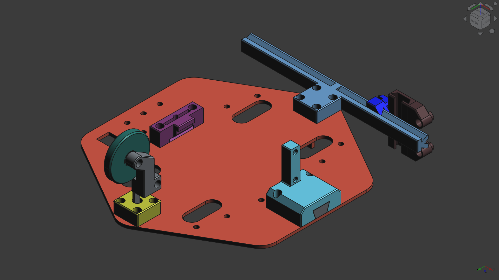

The SimpleBot chassis consists of several 3D-printed modules that attach to the main chassis plate.

---

## Chassis

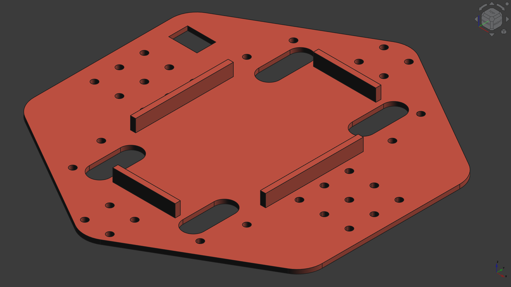

The main chassis plate serves as the foundation for all other components. All assembly steps attach to this plate.

---

## Battery Block

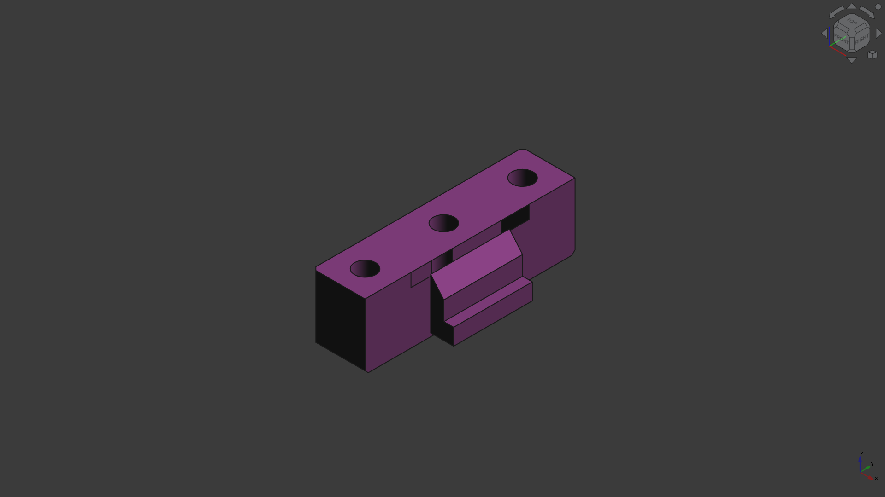

The battery block holds a 4xAA battery holder to the bottom of the chassis. It features a slot for a velcro strap, which holds the batteries in place and counteracts sagging from the weight of the batteries pulling down on the thin chassis plate.

**Assembly:**
- Install heat set inserts as needed
- Attach to chassis with screws
- Thread velcro strap through slot before final attachment

---

## Caster Assembly

### Caster Block
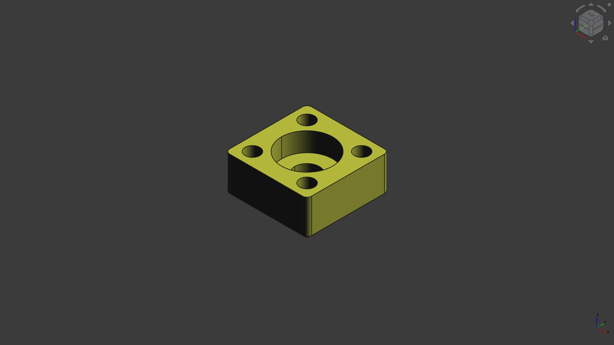

**Heat set inserts:** 4

### Caster Arm
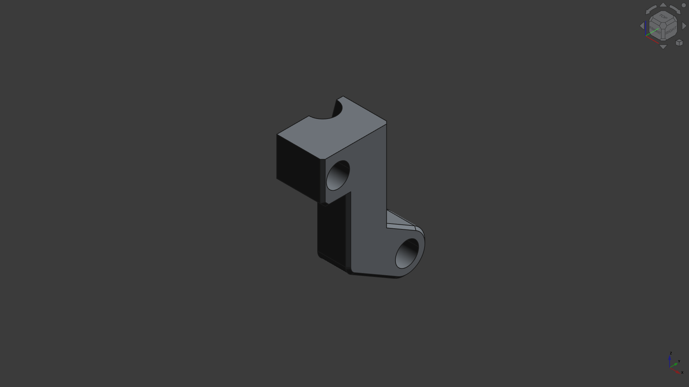

**Heat set inserts:** 2 (in one arm only)

**Note:** One caster arm must be 3D printed mirrored to create a matching pair.

### Caster Pin
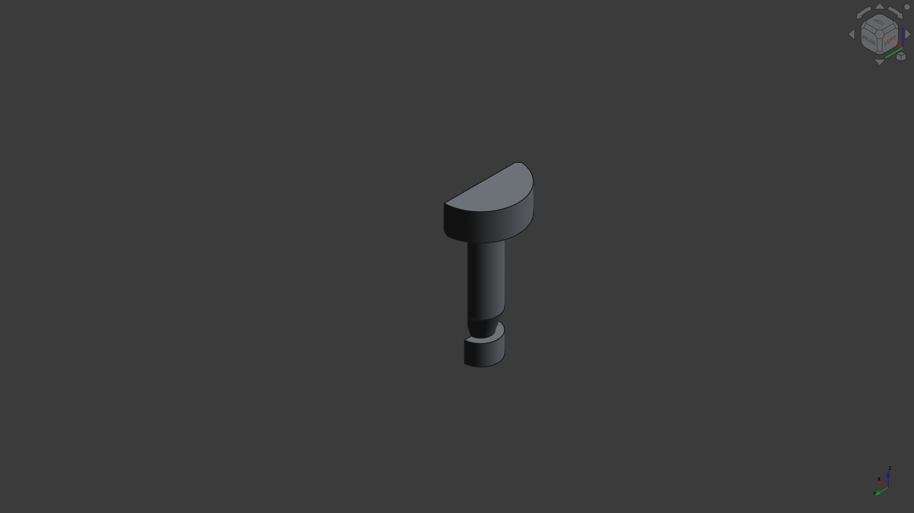

This is a "half pin" designed to print flat without supports. Two pins are required.

### Caster Wheel
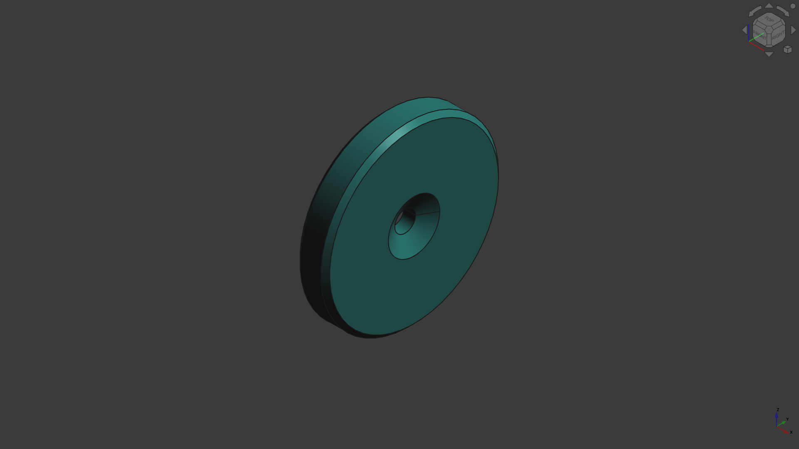

**Assembly Steps:**
1. Install 4 heat set inserts in the caster block
2. Install 2 heat set inserts in one caster arm
3. Insert two caster pins through the caster block
4. Position both caster arms around the bottom of the pins and around the caster wheel
5. Attach block to chassis with 4 screws
6. Join the two arms together with 2 screws (one serves as the wheel axle)

---

## Motor Mounts

### Dovetail
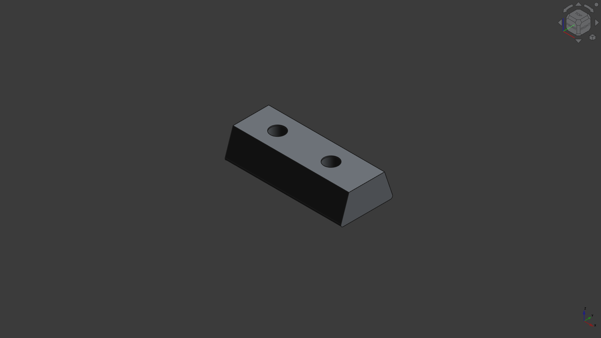

**Heat set inserts:** 2

### Motor Mount
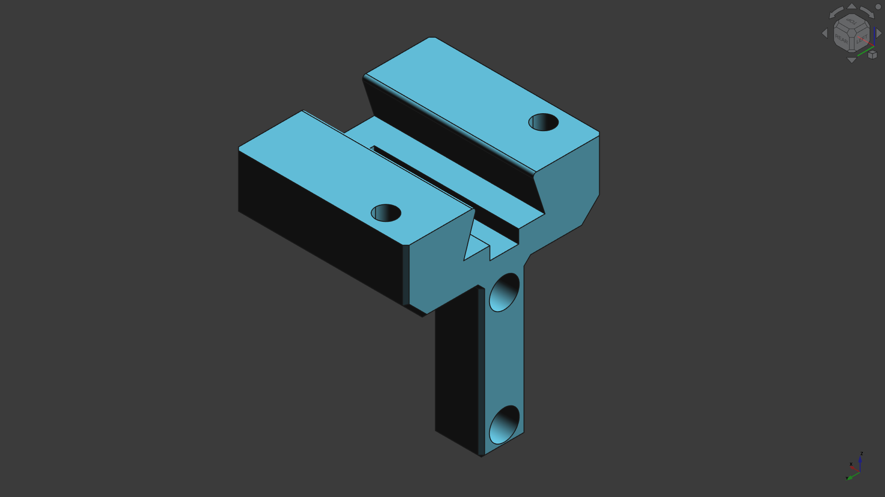

**Heat set inserts:** 3 (2 for motor, 1-2 for mount-to-dovetail attachment)

**Note:** These are symmetrical parts requiring 1x per side (2x total to mount both wheels).

**Assembly Steps:**
1. Install dovetail first to chassis (2 heat set inserts, 2 screws)
2. Mount motor to motor mount (2 screws into 2 heat set inserts)
3. Attach motor mount to chassis via dovetail (1-2 screws into heat set inserts)
4. Secure motor with single screw to prevent sliding

**Current Design Note:** No different attachments available at this time.

---

## Sensor System

### Sensor Rail
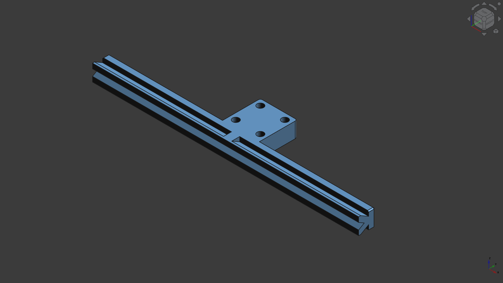

The sensor rail mounts to the underside of the chassis.

**Hardware:** 4 heat set inserts / 4 screws

### Sensor Block
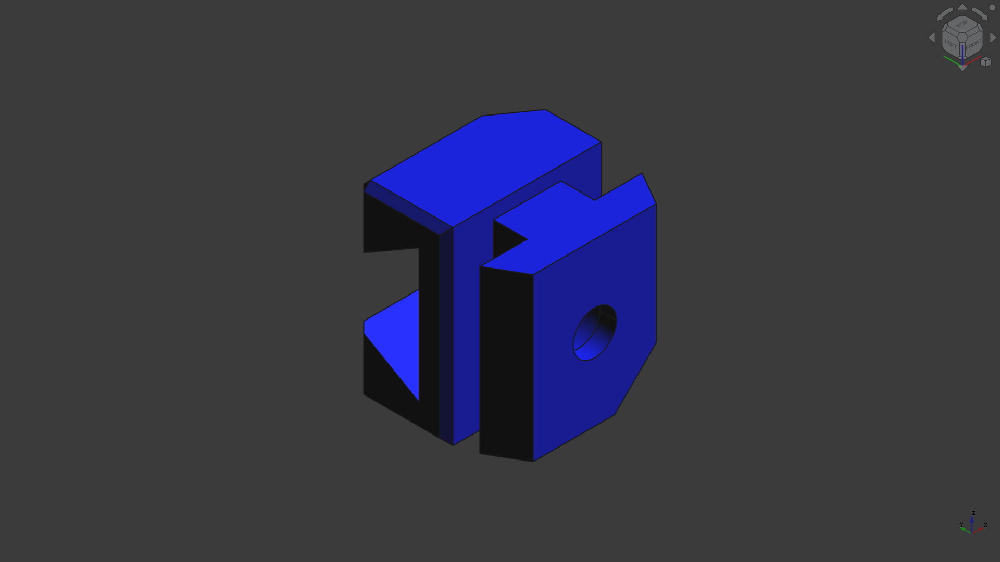

**Required:** 2x sensor blocks
**Heat set inserts per block:** 1

**Note:** One block *can* be printed mirrored for symmetry, but the cutout feature is only for printability (no supports needed) and doesn't require mirroring for function.

### Sensor Sled
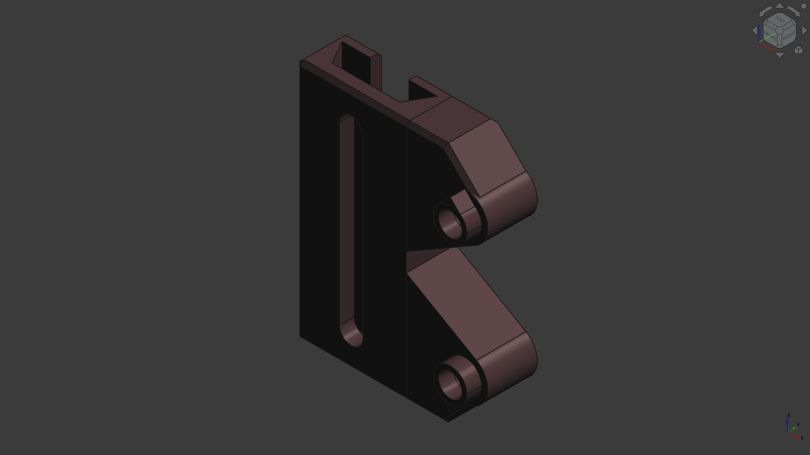

**Required:** 2x sensor sleds
**Heat set inserts per sled:** 1

**Note:** The sled is symmetrical - print twice in the same orientation, then flip one over and install the heat set insert in the opposite hole.

**Assembly Steps:**
1. Attach sensor rail to underside of chassis (4 screws into 4 heat set inserts)
2. Slide one sensor block onto the rail
3. Install 1 heat set insert in the sensor block
4. Slide sensor sled onto sensor block
5. Install 1 heat set insert in the sled
6. Attach line sensor module:
   - One screw through PCB hole into sled
   - Another screw goes through sled slot into sensor block
7. Adjust position by sliding block along rail and sled along block
8. Tighten screw until it bites slightly into sensor rail to lock position
9. Repeat for second sensor

**Design Note:** The unused hole in the sled aligns with a flat spot on the back of the line sensor PCB, providing support without requiring a screw.

---

## Final Assembly Checklist

- [ ] Battery block installed with velcro strap
- [ ] Caster assembly complete and secure
- [ ] Both motor mounts installed with motors
- [ ] Sensor rail attached to chassis
- [ ] Both sensor blocks and sleds installed
- [ ] Line sensors positioned and secured
- [ ] PCB mounted (see PCB_GUIDE.md)
- [ ] All wiring complete
