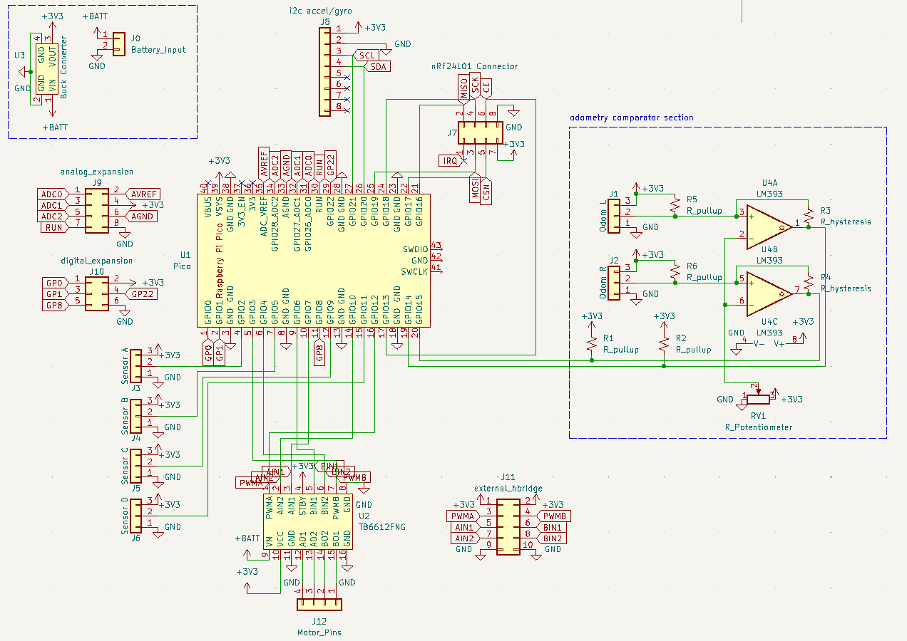
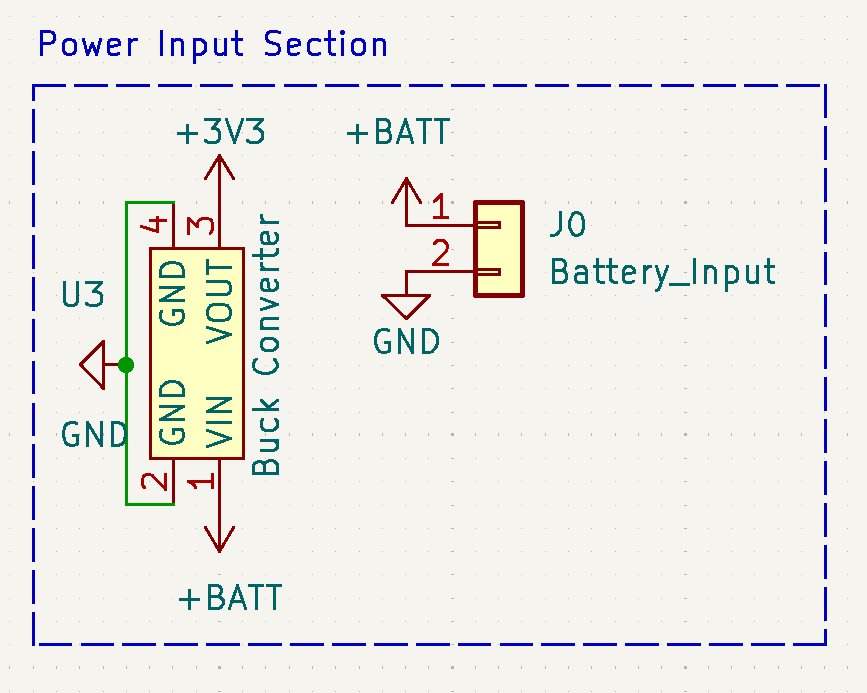
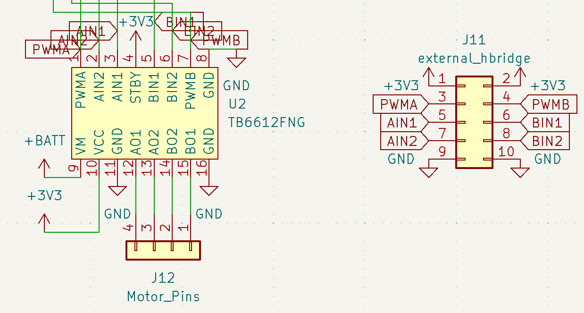
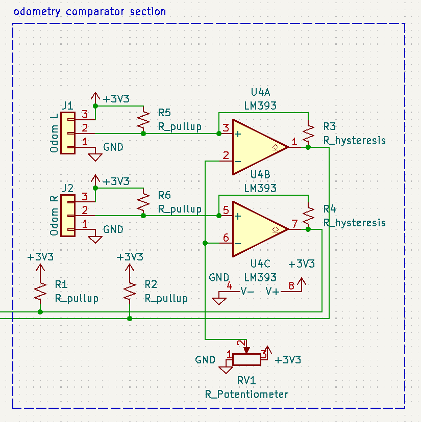
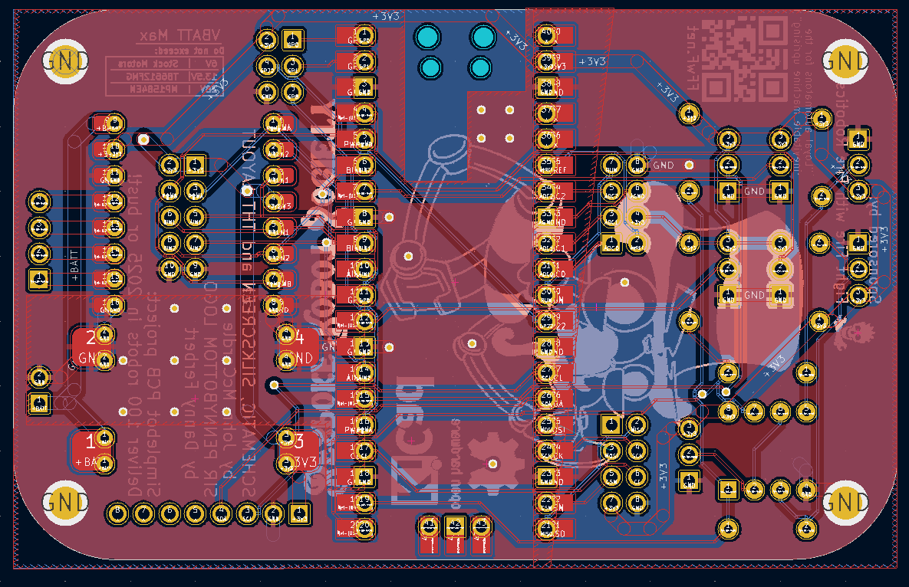
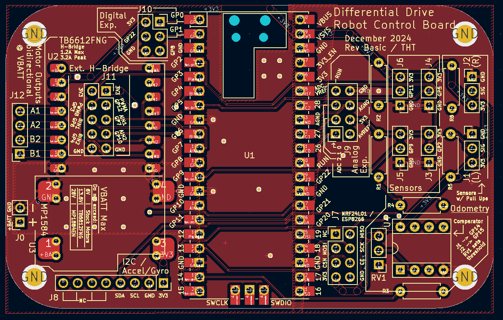
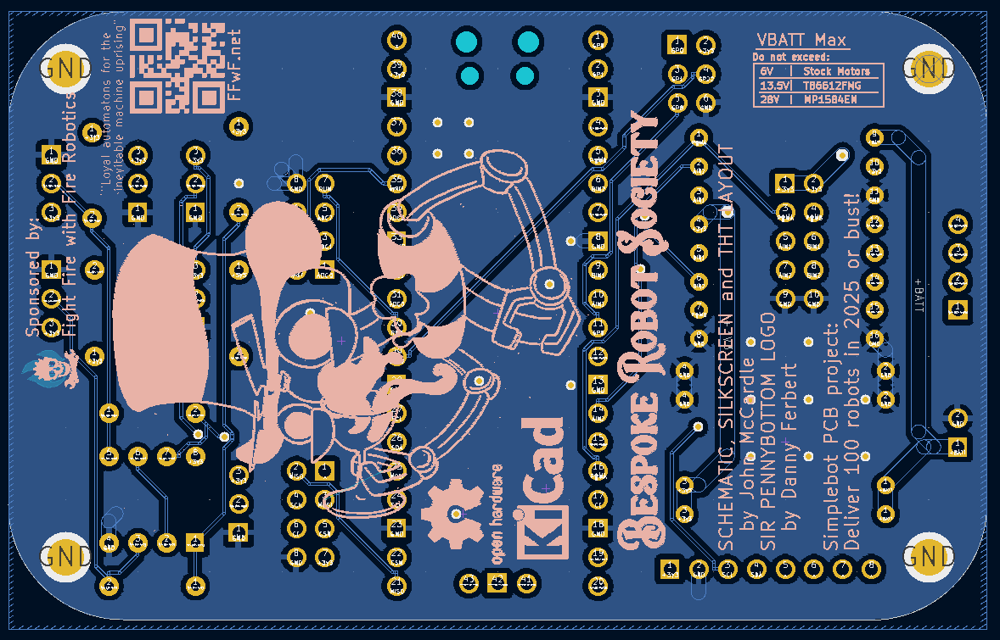

# SimpleBot PCB Guide

This guide explains the PCB design, functionality, and assembly instructions.

## PCB Overview

The SimpleBot PCB is built around a Raspberry Pi Pico microcontroller (or compatible) and integrates all necessary electronics for a complete differential drive robot with optical odometry and line following capabilities.

### Compatible Microcontrollers
You can use any 40-pin microcontroller with the same ground, PWM, and power pinout as the Pico:
- Raspberry Pi Pico (official or knockoff)
- Raspberry Pi Pico W
- Raspberry Pi Pico 2
- Raspberry Pi Pico 2 W

### Key Features
- **Microcontroller:** Pi Pico or compatible (40-pin header)
- **Motor Control:** TB6612FNG module with external H-bridge support
- **Power Management:** Adjustable buck converter for 3.3V regulation
- **Odometry:** LM393 comparator with voltage divider for optical encoders
- **Expansion:**
  - nRF24L01 radio header (SPI)
  - MPU6050 IMU header (I2C)
  - 4 dedicated sensor headers (GPIO + 3.3V + GND)
  - Analog expansion header
  - Digital expansion header

**Note:** The nRF24L01 and I2C gyro headers are designed for specific sensors but can be used as general GPIO if needed.

---

## PCB Sections

### Power Section

The power section manages battery input and voltage regulation.

**Components:**
- Buck converter module (adjustable)
- Power switch
- Battery input terminals

**IMPORTANT - Pre-Assembly Setup:**
1. **Tune buck converter to 3.3V BEFORE soldering** to the PCB
2. Use a multimeter to verify output voltage
3. Connect power switch to disable battery power when USB cable is inserted

**Power Flow:**
- 4xAA batteries (6V nominal) → Power switch → Buck converter → 3.3V regulated output
- USB power available when connected to Pico

---

### Motor Control Section

The motor section uses a TB6612FNG dual H-bridge module.

**Standard Configuration:**
- TB6612FNG module solders directly to PCB
- Controls two TT motors independently
- PWM speed control for both motors

**Advanced Configuration - External H-Bridge:**
Underneath the TB6612FNG module position, a 2x5 DuPont pin header can be installed. This header provides:
- PWM signals (both motors)
- IN1/IN2 direction control (both motors)
- 3.3V logic power
- Ground

**Benefit:** Use a larger external H-bridge for more powerful motors while using the **exact same Python code** - the control signals are identical.

**Motor Connections:**
- Motor A: Left wheel
- Motor B: Right wheel
- Connect encoder discs to optical encoder section

---

### Optical Encoder (Odometry) Section

The odometry section reads slotted encoder wheels to measure distance traveled.

**Components:**
- LM393 dual comparator
- Voltage divider circuit
- Analog sensor inputs (2 channels)

**Sensor Configuration:**
- LED shines through encoder wheel slots
- Photoresistor detects light/dark transitions
- LM393 converts analog signal to clean digital pulses
- Pico counts pulses to calculate wheel rotation

**Each Channel:**
- 1x LED (through encoder slot)
- 1x Photoresistor
- Voltage divider resistors
- Comparator output to Pico GPIO

---

## PCB Layers and Manufacturing

### All Layers View

Complete view of all PCB layers for manufacturing reference.

### Front View

Component placement on the top side of the PCB.

### Back View

Bottom side of the PCB (primarily traces and ground plane).

---

## Assembly Instructions

The SimpleBot PCB uses through-hole components for easy assembly with basic soldering equipment. This makes it ideal for educational builds and beginners.

### Step 1: Power Section
1. Verify buck converter outputs 3.3V (CRITICAL!)
2. Solder buck converter to PCB
3. Install power switch
4. Test voltage output before proceeding

### Step 2: Pico Socket
1. Solder 40-pin headers for Pico
2. Insert Pico (do not solder Pico directly - use sockets for easy replacement)

### Step 3: Motor Controller
1. Solder TB6612FNG module directly to PCB
   - OR -
2. Install 2x5 pin header for external H-bridge (underneath TB6612 position)

### Step 4: Optical Encoder Circuit
1. Install LM393 IC
2. Install resistors for voltage divider
3. Solder LED holders/headers
4. Solder photoresistor terminals

### Step 5: Expansion Headers
1. Install nRF24L01 header (if using radio)
2. Install MPU6050 header (if using IMU)
3. Install 4x sensor headers
4. Install analog/digital expansion headers

### Step 6: Testing
1. Connect USB power to Pico
2. Verify 3.3V on all power rails
3. Test motor outputs (no motors connected yet)
4. Check encoder circuit outputs
5. Install in chassis and connect motors

---

## Gerber Files

PCB manufacturing files are available in the repository:
- `diffdrive_robot_microcontroller_board--tht_Gerber.zip`

Upload this file to your preferred PCB manufacturer (JLCPCB, PCBWay, OSH Park, etc.).

---

## Software

See the main [README.md](README.md) for software installation and programming instructions.
